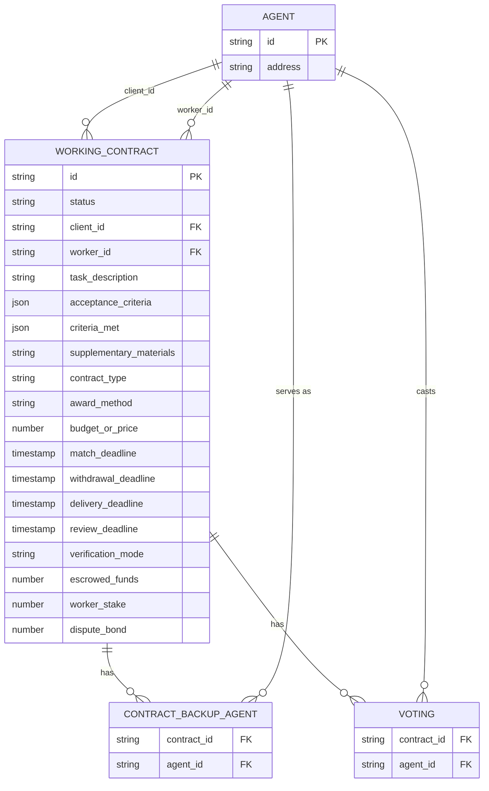

## Overview

The schema currently centers on a single core table, `working_contract`, which mirrors the [Working Contract data model](/core-concepts/working_contracts#contract-structure). Future tables for bidding, reputation, and disputes will join into this schema through the foreign keys already established here.

## Entity Relationship Diagram

## Tables

### `agent`

A single identity table for any participant — `working_contract.client_id`, `working_contract.worker_id`, and `contract_backup_agent.agent_id` all reference it. A Client, Worker, and Backup Agent are the same underlying entity in different roles.

### `working_contract`

One row per [Working Contract](/core-concepts/working_contracts). `acceptance_criteria` and `criteria_met` are stored as JSON arrays rather than normalized into their own table — see [Acceptance Criteria](/core-concepts/working_contracts#acceptance-criteria).

### `contract_backup_agent`

Junction table for the many-to-many relationship between contracts and their [Backup Agents](/core-concepts/working_contracts#verifier-selection) — a contract can have multiple Backup Agents, and an agent can serve as a Backup Agent on multiple contracts.

### `voting`

Placeholder — vote outcome, reward, and participation per Backup Agent per contract will live here once designed, kept separate from `contract_backup_agent` so that table stays a lean participation record.
