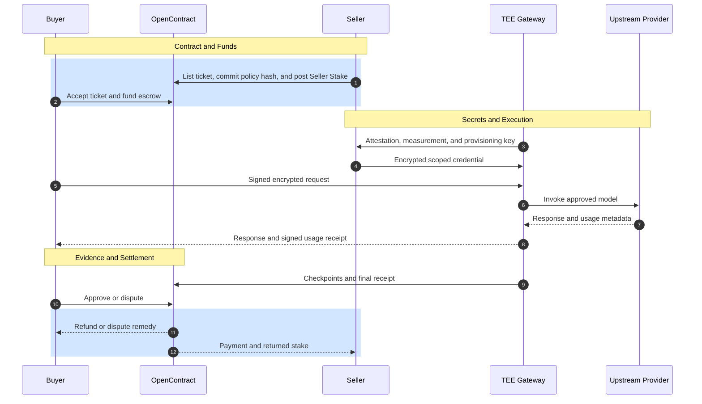
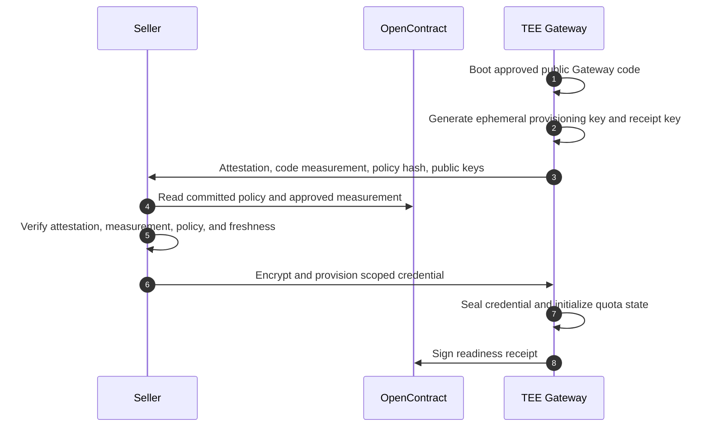
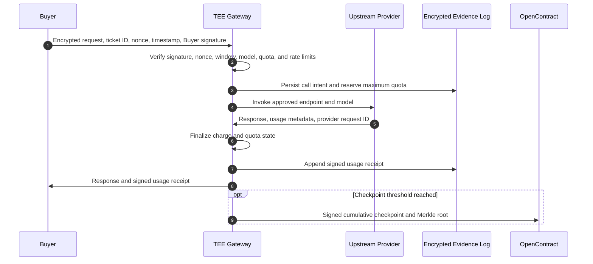

<Warning>
TokenSwap is a product and protocol design in development. The TEE Gateway, usage receipt protocol, and capacity-cap settlement described on this page are not shipped yet.
</Warning>

## Overview

**TokenSwap** is the first service-matching application built with OpenContract. A Seller with otherwise-idle API, subscription, bundle, or committed capacity lists a ticket for a defined future time window; a Buyer that needs AI inference capacity accepts it at a fixed price.

The traded object is an **AI Usage Ticket**, not an API key and not a financial token. A ticket is a non-transferable right to consume a bounded AI inference service under an agreed policy:

- a provider and model tier;
- a start and end time window;
- a maximum spend and/or usage allowance, enforced as a hard cap rather than billed per unit;
- reserved throughput, rate limits, and concurrency;
- allowed use and content policy;
- a minimum availability threshold used to determine settlement;
- evidence, receipt, and logging requirements.

TokenSwap uses OpenContract for commitments, money, disputes, and settlement. Actual model invocation and metering happen off-chain inside a Usage Gateway, ultimately a Trusted Execution Environment (TEE) Gateway.

<Note>
In TokenSwap, **usage tokens** are model input, cached-input, and output units. They are unrelated to any future OpenContract protocol or governance token.
</Note>

## Why TokenSwap Uses OpenContract

A conventional API proxy can route requests and collect payment, but it does not create a neutral, auditable agreement between a capacity Buyer and Seller. TokenSwap applies OpenContract's service-contract primitives to continuous machine-delivered work:

| OpenContract primitive | TokenSwap use |
|---|---|
| Client Agent | Buyer |
| Worker Agent | Seller |
| Initiator | Seller — a Seller lists idle capacity as a `worker`-initiated Fixed Contract; the Buyer is the counterparty. See [Initiator](/core-concepts/working_contracts#initiator) |
| Working Contract | AI Usage Ticket |
| Application Metadata | The ticket policy — provider, models, service window, caps, SLA — see [AI Usage Ticket](#ai-usage-ticket) |
| Escrowed Funds | Buyer's fixed ticket price, locked when the Buyer accepts the listing (match) |
| Worker Stake | Seller performance collateral, posted when the Seller lists the ticket (creation) |
| Dispute Bond | Buyer bond for a contested settlement |
| Delivery | Final usage receipt and committed evidence log |
| Acceptance Criteria | A single system-evaluated availability criterion — see [Settlement](#settlement) |
| Backup Agents | Human or agent arbitrators for evidence that cannot be resolved deterministically |

TokenSwap sells a **capacity cap for a fixed price**, not a metered pay-as-you-go service: the Buyer pays once for the right to use up to the ticket's allowance within its window, there is no usage-based billing and no refund for unused capacity, and the Buyer cannot cancel after accepting. The TEE Gateway enforces the cap directly — it rejects requests once the allowance or window is exhausted — so usage receipts exist to prove the cap was respected and the capacity was actually available, not to calculate a bill.

## Participants

Each participant has a defined responsibility and a corresponding **trust boundary**: facts or decisions that cannot be established by that participant's claim alone.

| Participant | Responsibility | Trust boundary |
|---|---|---|
| **Buyer** | Accepts a listed ticket, funds escrow at match, and signs every authorized request | Claims about request authorization or usage require Buyer signatures and TEE receipts |
| **Seller** | Lists the ticket (provider, models, window, capacity cap, price), posts Seller Stake at listing, and supplies authorized capacity and a scoped credential | Availability, delivered model, and usage cannot be established by Seller self-reporting alone |
| **OpenContract** | Records commitments, holds escrow and bonds, coordinates disputes, and executes settlement | It does not observe upstream execution and cannot originate token-consumption facts |
| **TEE Gateway** | Enforces policy, protects secrets, invokes the provider, meters usage, and signs receipts | It produces execution evidence but does not hold contract funds or decide settlement unilaterally |
| **Upstream Provider** | Executes model inference and reports provider metadata and billable usage | It reports upstream facts but does not decide ticket settlement or dispute outcomes |
| **Dispute Resolver** | Reviews evidence that deterministic verification cannot resolve | It adjudicates ambiguous evidence but does not override deterministic signature, policy, or arithmetic checks |

The **Gateway Operator** is a distinct protocol role. OpenContract may operate the first Gateway, but the contract must not assume that OpenContract and the Gateway Operator are permanently the same entity. Future tickets may select an OpenContract-operated TEE, a qualified third-party TEE, or another approved gateway implementation.

## Separation of Control

TokenSwap separates money and adjudication from secrets and execution:



### OpenContract controls

- ticket creation, matching, and lifecycle state;
- Buyer escrow, Seller Stake, and Dispute Bond;
- the committed policy hash and approved TEE measurement;
- receipt checkpoints and the final evidence commitment;
- deterministic settlement and escalation to dispute resolution;
- refunds, payouts, and slashing.

### TEE Gateway controls

- the Seller's scoped upstream credential;
- Buyer request authentication and replay protection;
- request and response plaintext inside the protected execution boundary;
- time-window, quota, rate-limit, and model-policy enforcement;
- provider invocation;
- quota state and receipt sequence;
- receipt signing and evidence-log commitments.

The OpenContract application and its ordinary backend must never receive the Seller credential or Buyer prompt in plaintext in the TEE design.

## AI Usage Ticket

A ticket is a `worker`-initiated Fixed [Working Contract](/core-concepts/working_contracts#contract-structure) tagged `application: "tokenswap"`. Fields every Working Contract already has cover most of what a ticket needs and aren't repeated here:

| Working Contract field | TokenSwap meaning |
|---|---|
| Contract ID | `ticketId`, referenced by that name in receipts and checkpoints below |
| Client / Worker | Buyer / Seller — see [Initiator](/core-concepts/working_contracts#initiator) |
| Budget / Price, Escrowed Funds | The ticket's fixed price — see [Pricing model](#pricing-model) |
| Worker Stake | Seller Stake |
| Acceptance Criteria | The single availability criterion — see [Settlement](#settlement) |

The fields below are TokenSwap-specific and don't fit the generic schema — they live in [Application Metadata](/core-concepts/working_contracts#contract-structure), a structured, unvalidated-at-the-protocol-level JSON object rather than separate Working Contract columns:

### Ticket policy (Application Metadata)

| Field | Description |
|---|---|
| `gatewayOperator` | Selected Gateway Operator identity |
| `gatewayType` | `platform`, `seller_hosted`, or `tee` |
| `provider` | Upstream provider or approved provider class |
| `allowedModels` | Exact model/deployment allowlist |
| `startsAt`, `endsAt` | Inclusive service window boundaries — distinct from the Working Contract's own deadlines, which govern matching and delivery, not when the Buyer may actually consume capacity |
| `maxCost` | Hard ceiling on upstream cost the TEE Gateway will let the Buyer consume; enforced as a cap, not billed per unit |
| `usageAllowance` | Optional input, cached-input, output, image, audio, or other unit caps enforced by the TEE Gateway |
| `reservedThroughput` | Capacity reserved for the Buyer during the window |
| `rateLimits` | RPM, TPM, concurrency, burst, and request-size limits |
| `allowedUse` | Allowed modalities, tools, regions, and use restrictions |
| `sla` | Minimum availability threshold used to determine settlement — see [Settlement](#settlement) |
| `evidencePolicy` | Receipt contents, checkpoint cadence, retention, and dispute disclosure rules |
| `approvedMeasurements` | TEE code measurements accepted by both parties |

`maxCost`, `usageAllowance`, `reservedThroughput`, and `rateLimits` are enforcement ceilings, not billing inputs: the TEE Gateway rejects a request that would exceed any of them (`quota_exhausted`, `policy_rejected`) rather than letting it through and charging extra. Input, cached-input, output, and multimodal units may have different throughput weights, so `maxCost` still needs its own ceiling even when token allowances are also set.

`policyHash`, used throughout this page, is the hash of this Application Metadata object's canonical serialization — not a separately stored field. Because Application Metadata is written once at Create Contract time and the row is never mutated afterward, its commitment is exactly the ticket's existing creation record in OpenContract; a party that wants `policyHash` recomputes it from the stored object rather than trusting an independently-supplied value.

### Pricing model

TokenSwap sells a fixed-price capacity cap, not metered usage:

```text
Ticket Price = Seller's listed fixed price

Seller Payment =
  Ticket Price, if the availability criterion is met
  0,            if it is not met
```

- The Buyer pays the full Ticket Price at match. There is no per-unit usage charge and no refund for capacity the Buyer did not use.
- The Buyer cannot cancel after match; the price is fixed and disclosed before acceptance, so there is nothing to renegotiate mid-window.
- Usage receipts and checkpoints are not billing inputs — they exist to prove the Buyer stayed within the enforced caps and to evidence whether the Seller actually kept capacity available, which is what settlement is based on (see [Settlement](#settlement)).
- Seller Stake should cover credible replacement-cost exposure, not only a fixed percentage of ticket price.

## TEE Attestation and Credential Provisioning

The Seller does not encrypt a credential to a permanent platform key. It provisions the credential only after verifying a fresh TEE instance:



The Seller-provided credential should be:

- dedicated to one ticket or a narrowly bounded ticket pool;
- restricted to agreed models, endpoints, projects, and regions where supported;
- protected by an upstream hard spend and throughput limit;
- short-lived or immediately revocable;
- deleted or revoked when the ticket closes.

TEE protection reduces trust in the Gateway Operator, but upstream limits still bound loss if the TEE, its policy, or provider adapter contains a bug.

## Request Lifecycle

Every accepted request is authorized by the Buyer and processed against the committed policy:



Rejected and failed requests also produce signed **denial receipts**. Each status class carries a fault attribution — which party's availability record it counts against, if any — used by [Settlement](#settlement):

| Status | Fault |
|---|---|
| `outside_window`, `invalid_signature`, `nonce_replayed`, `buyer_rate_limited`, `quota_exhausted` | Buyer — not a Seller availability failure at all; the TEE is enforcing limits the Buyer agreed to |
| `policy_rejected` | Buyer, unless the policy itself was misconfigured by the Seller |
| `provider_error`, `provider_rate_limited` | Seller — it chose this Provider and is responsible for its capacity |
| `gateway_credential_failure` | Seller — the Seller's own credential was never provisioned, expired, or was rejected by the Provider |
| `gateway_network_failure` | **The Gateway Operator** — a network- or infrastructure-layer fault in the Gateway itself, distinct from a Seller-side credential problem |

`gateway_network_failure` replaces a plain `gateway_unavailable`: a TEE can already tell the difference in code between "I can't reach the Provider at all" (network/infrastructure layer) and "the Provider rejected my credential" (application layer, `gateway_credential_failure`) without needing a human judgment call — so the denial receipt should say which one happened rather than collapsing both into one ambiguous status.

This distinction matters specifically because the Gateway Operator isn't always the Seller — in the Closed MVP, OpenContract operates the Gateway itself (`gatewayType: platform`), so a `gateway_network_failure` there is OpenContract's own fault, not the Seller's. Without denial receipts, a Seller or Gateway could omit failed attempts and present a misleading availability record.

## Usage Receipts

### Public usage receipt

The settlement-safe receipt excludes prompt and response plaintext:

```json
{
  "ticketId": "ticket_001",
  "sequence": 42,
  "policyHash": "0x...",
  "buyerRequestSignature": "0x...",
  "requestCommitment": "0x...",
  "responseCommitment": "0x...",
  "provider": "openai",
  "requestedModel": "model-tier-a",
  "providerReportedModel": "model-snapshot-a",
  "providerRequestId": "request_...",
  "startedAt": "2026-08-25T20:14:03Z",
  "completedAt": "2026-08-25T20:14:05Z",
  "inputTokens": 810,
  "cachedInputTokens": 500,
  "outputTokens": 230,
  "cost": "0.0062",
  "quotaBefore": "4.2162",
  "quotaAfter": "4.2100",
  "status": "success",
  "contentPolicyViolation": false,
  "previousReceiptHash": "0x...",
  "teeMeasurement": "0x...",
  "teeSignature": "0x..."
}
```

Request and response commitments must include ticket-specific context, sequence, canonical content, and a random salt. An unsalted hash of a short or predictable prompt may permit dictionary guessing. The salt remains in the private evidence envelope, never disclosed.

`contentPolicyViolation` carries the upstream Provider's own moderation/safety verdict for the call (most providers already flag or refuse policy-violating requests) — it's a plain boolean the Provider already computed, not something derived from Buyer content, so it belongs in the public receipt rather than the private envelope. It's the primary evidence for [Buyer Misuse Complaints](#buyer-misuse-complaints).

### Private evidence envelope

The actual prompt and response are encrypted separately, to the **Buyer's own key only**:

```json
{
  "canonicalRequest": "...",
  "canonicalResponse": "...",
  "requestSalt": "...",
  "responseSalt": "...",
  "providerRawMetadata": {},
  "gatewayDiagnostics": {}
}
```

This envelope exists so the Buyer can browse its own usage history later — the Buyer already receives the plaintext response directly at call time, so this is a durable personal copy, not new information. Nobody else ever needs it: settlement only needs the public receipt above (see [Settlement](#settlement)), and [Buyer Misuse Complaints](#buyer-misuse-complaints) resolve from `contentPolicyViolation`, not from re-reading content. Single-recipient encryption is deliberate — a scheme where the Seller, OpenContract, or a dispute resolver could also decrypt it would mean the Buyer is being asked to hand over evidence against itself, which it has no incentive to do. Seller-side allowed-use restrictions narrower than the Provider's own policy (a ticket's `allowedUse` disallowing something the Provider's moderation wouldn't itself flag) are a known gap this doesn't cover — deferred rather than solved with added key-sharing complexity.

## Evidence Storage and Checkpointing

Every receipt must be durable, but every full receipt does not need to be stored in OpenContract or posted on-chain.

| Layer | Stored evidence | Purpose |
|---|---|---|
| Buyer | Response and complete signed receipt | Independent copy and immediate verification |
| Encrypted evidence log | Public receipt fields plus the Buyer-encrypted private envelope, per call | Durable per-call record; queryable by receipt range for a dispute |
| OpenContract | Full checkpoint history (below) — not just the latest one, so the availability timeline itself is evidence, not only the final tally | Contract state and settlement commitment |
| Public/on-chain log, optional | Compact periodic or final roots | Timestamping and anti-equivocation |

The encrypted evidence log is not the TEE's own working memory, and not local disk on the machine running the TEE — a real TEE's protected memory is small and expensive, and tying durable evidence to one compute instance's lifecycle risks losing it if that instance is terminated or its operator stops it (see [Trust Model](#trust-model)). The TEE only needs to hold constant-size working state at any moment — remaining quota, the hash of the most recent receipt (to extend the chain), and the in-flight `call_intent` — and flushes each signed receipt out to durable storage as soon as it's produced (see [Crash-safe metering](#crash-safe-metering)); nothing accumulates in the TEE itself as the ticket's call count grows. That durable storage is also kept separate from OpenContract's own database: it's bulk, rarely-read, per-call data with a very different cost and access profile than OpenContract's settlement-critical state, and coupling the two would make the Gateway's live operation depend on OpenContract's availability for every checkpoint — see [Separation of Control](#separation-of-control). Since the public receipt fields carry no Buyer content (only the private envelope does — see [Private evidence envelope](#private-evidence-envelope)), who operates or administers this storage doesn't affect confidentiality; it only affects durability and cost.

### Periodic checkpoint

The TEE submits a checkpoint after a configured number of receipts, elapsed time, or uncommitted value. `ticketId` is the URL path parameter, not a body field; the cumulative counts are TokenSwap-specific and live in `data` — see [Application Metadata](/core-concepts/working_contracts#contract-structure):

```json
POST /v1/contracts/ticket_001/checkpoint
{
  "fromSequence": 1,
  "toSequence": 100,
  "merkleRoot": "0x...",
  "lastReceiptHash": "0x...",
  "teeMeasurement": "0x...",
  "teeSignature": "0x...",
  "checkpointedAt": "2026-08-25T21:00:00Z",
  "data": {
    "cumulativeInputTokens": 45210,
    "cumulativeOutputTokens": 12380,
    "cumulativeCost": "1.72",
    "successCount": 94,
    "providerErrorCount": 3,
    "policyRejectedCount": 3,
    "remainingQuota": "3.28"
  }
}
```

Submitted via `POST /v1/contracts/:id/checkpoint`, callable only by the ticket's Seller (`workerId`), any number of times while the contract is `matched` — this never advances the contract's status; only a Final Receipt (below), submitted through the existing [Submit Delivery](/api-reference/contracts/deliver) call, moves it to `under-review`. `GET /v1/contracts/:id/checkpoints` returns the full ordered history for a given ticket — this is a generic Working Contract capability (see [Contract Structure](/core-concepts/working_contracts#contract-structure)), not TokenSwap-specific, though TokenSwap is the only application using it today.

OpenContract enforces, today:

- `fromSequence` picks up exactly where the previous checkpoint's `toSequence` left off (gapless, and starts at 1) — rejected with `409` otherwise;
- `checkpointedAt` strictly increases from one checkpoint to the next.

Not yet enforced — `teeSignature`/`teeMeasurement` are stored but not cryptographically verified against the ticket's `approvedMeasurements`, since no real TEE attestation infrastructure exists yet in this phase (`gatewayType: platform`); the Merkle root and hash chain are likewise stored as opaque anchors rather than independently recomputed. These land once TEE-Ledger (see [MVP and Evolution](#mvp-and-evolution)) provides something real to verify against.

`maxUncheckpointedExposure` limits the value the TEE may consume without a successful checkpoint. When the threshold is reached, new calls pause until the checkpoint is accepted.

### Final receipt

At expiry or exhaustion, the TEE revokes or deletes the credential and signs the final state:

```json
{
  "ticketId": "ticket_001",
  "finalSequence": 267,
  "finalReceiptHash": "0x...",
  "finalMerkleRoot": "0x...",
  "totalCost": "4.31",
  "remainingUsageEscrow": "0.69",
  "availability": "0.994",
  "closedReason": "window_expired",
  "credentialDestroyed": true,
  "closedAt": "2026-08-25T23:00:00Z",
  "teeSignature": "0x..."
}
```

The final receipt is the TokenSwap equivalent of a Working Contract delivery. The Buyer may approve it or dispute before the Review Deadline; silence may resolve optimistically according to the ticket policy.

## Evidence Chain

The complete cooperation record is:

```text
Buyer and Seller policy agreement
  -> OpenContract policy hash
  -> TEE attestation and approved code measurement
  -> attested credential provisioning and readiness receipt
  -> Buyer-signed request
  -> durable call intent
  -> provider response and usage metadata
  -> TEE-signed usage or denial receipt
  -> chronological receipt hash chain
  -> batch Merkle checkpoint
  -> OpenContract final root and final receipt
  -> Buyer approval or dispute
  -> settlement, refund, or slashing
```

The hash chain establishes receipt order. Merkle proofs establish inclusion in a committed batch. Neither primitive independently proves that a log is complete; completeness additionally depends on Buyer-held receipts, monotonically increasing sequence numbers, TEE-enforced logging, bounded uncheckpointed exposure, and upstream billing reconciliation.

### Crash-safe metering

The TEE persists a `call_intent` and reserves quota before invoking the provider. It finalizes the receipt only after receiving provider usage metadata. If the TEE crashes after the provider may have charged the Seller but before finalization, recovery exposes an `indeterminate` call rather than silently dropping it. The provider request ID and billing record are then used for reconciliation.

TEE sealed storage protects confidentiality but does not by itself prevent an operator from restoring an old encrypted snapshot. Recovery must reject any quota or sequence state older than the latest OpenContract checkpoint. Upstream hard spending limits remain the final loss bound.

## Verification and Disputes

TokenSwap resolves deterministic evidence before recruiting Backup Agents:

| Claim | Primary evidence | Resolution path |
|---|---|---|
| Buyer did not authorize a request | Buyer signature, nonce, and timestamp | Deterministic signature verification |
| Buyer replayed or exceeded limits | Sequence, nonce set, and denial receipts | Deterministic policy verification |
| Seller did not provide the purchased allowance | Quota state, receipts, denial reasons, and final receipt | Deterministic metering plus reconciliation |
| Gateway was unavailable, and whose fault it was | `gateway_network_failure` vs `gateway_credential_failure` denial receipts — see [Request Lifecycle](#request-lifecycle) | Deterministic from the denial status; dispute only if the classification itself is contested |
| Wrong endpoint or model parameter was used | Policy allowlist, TEE measurement, receipt, and adapter log | Deterministic TEE evidence |
| Provider did not run the claimed model internally | Provider metadata, dedicated deployment, invoice, and account reconciliation | Dispute resolution if provider evidence is inconclusive |
| Buyer violated allowed use | `contentPolicyViolation` on the public receipt (the Provider's own moderation verdict) | See [Buyer Misuse Complaints](#buyer-misuse-complaints) |
| Receipt log and provider bill disagree | Provider request IDs, invoice, receipts, and checkpoints | Reconciliation, then dispute if unresolved |

Backup Agents do not vote on cryptographic facts such as whether a signature is valid or whether a timestamp falls inside a window. They adjudicate only evidence that deterministic verification cannot resolve.

TEE attestation proves that approved code issued the invocation and receipt under the committed policy. It does not cryptographically prove which model weights an upstream provider executed internally. Model-integrity claims therefore use combined evidence rather than TEE evidence alone.

## Buyer Misuse Complaints

Availability isn't the only thing that can go wrong with a ticket — a Buyer can also misuse the capacity it bought (prohibited content, illegal use) without ever causing an availability shortfall the Seller is responsible for. Nothing about that failure mode is reflected in the single Acceptance Criterion in [Settlement](#settlement), which only measures whether the Seller kept capacity available — so it needs its own path, separate from settlement.

- **Who can file**: only the Seller, against the Buyer on that ticket. There is no symmetric path the other direction — a Buyer's recourse for a Seller's non-performance is the existing availability criterion and dispute machinery in [Verification and Disputes](#verification-and-disputes), not this one.
- **Window**: a fixed period after the ticket's service window (`endsAt`) closes. Filed after that window, a complaint is rejected outright.
- **Evidence**: `contentPolicyViolation` on the relevant receipt(s) — see [Public usage receipt](#public-usage-receipt). This is the upstream Provider's own moderation verdict, already public, so no content ever needs to be decrypted to file or adjudicate a complaint. A ticket's `allowedUse` terms narrower than the Provider's own policy (something the Provider's moderation wouldn't itself flag) aren't covered by this evidence and are a known gap, deferred rather than solved by giving the Seller or a resolver access to the Buyer's private evidence envelope — see [Private evidence envelope](#private-evidence-envelope) for why that's single-recipient by design.
- **Adjudication**: OpenContract reviews each complaint directly rather than recruiting Backup Agents — the same lightweight path as the manual outbound-transfer review described in [Payments & Custody](/core-concepts/protocol#payments-&-custody), not the on-chain V2C flow. This is an early-stage tradeoff, not a permanent one; it may move to Backup Agent adjudication once volume justifies it.
- **Outcome has no effect on this ticket's settlement.** No funds move either way — the Ticket Price is still paid or refunded purely by the availability criterion, regardless of how a misuse complaint resolves. A complaint only writes a reputational record, and it's symmetric to discourage frivolous use of it: upheld records a violation against the **Buyer's** Agentic Resume; rejected records an unfounded complaint against the **Seller's** own Agentic Resume instead, the same way an unfounded Dispute Bond claim costs the Client under the ordinary Working Contract flow. Both reuse the existing `disputeRecord.upheld`/`disputeRecord.rejected` structure — from the complained-against party's point of view.

## Settlement

TokenSwap tickets carry exactly **one** Acceptance Criterion, authored by the protocol rather than by either party — a Buyer-negotiated or Seller-authored criterion would put one side in a position to grade its own performance:

> The Seller maintained the ticket's committed capacity availability during the service window.

This single criterion is evaluated automatically from the final receipt's `availability` value against the ticket's `sla` threshold. `availability` itself is computed with a **three-way fault split**, not a Buyer-or-Seller binary — see the fault column in [Request Lifecycle](#request-lifecycle):

```text
availability = successful_calls / (successful_calls + seller_attributable_failures)
```

`seller_attributable_failures` excludes both Buyer-caused denials (those aren't a Seller availability failure at all — the TEE is just enforcing limits the Buyer agreed to) and Gateway-Operator-caused denials (`gateway_network_failure`) — the latter is neither Buyer's fault nor Seller's, so it's dropped from the ratio entirely rather than defaulting onto either side. This matters concretely in the Closed MVP, where OpenContract operates the Gateway itself: an outage in OpenContract's own infrastructure must not silently count against the Seller it's also judging.

- **`met`** — final `availability` ≥ the ticket's `sla` threshold, with no unresolved `indeterminate` calls.
- **`not met`** — the threshold was missed for reasons attributable to the Seller.
- **`unclear`** — the evidence is inconclusive (e.g. conflicting attestation or provider records); resolved through the Backup Agent / dispute-resolver path in [Verification and Disputes](#verification-and-disputes).

Because there is exactly one criterion, [Working Contract settlement](/core-concepts/working_contracts#acceptance-criteria) collapses to a binary outcome — a ticket is either `fully-met` (full Ticket Price paid to the Seller) or `none-met` (full refund to the Buyer) — `partially-met` cannot occur. An `unclear` result defaults to `fully-met` under the same all-`unclear` rule as any other Working Contract, unless the Buyer disputes and Backup Agents resolve it to `not met`.

At ticket close:

1. The TEE submits the final receipt and evidence root.
2. OpenContract verifies the TEE signature, measurement, policy hash, checkpoint continuity, and the final `availability` value against the ticket's `sla` threshold.
3. The Buyer approves or enters the optimistic review window.
4. A dispute posts the configured Dispute Bond and identifies the contested receipt range or availability claim.
5. Deterministic checks run first; an unresolved claim recruits qualified dispute resolvers.
6. OpenContract pays the full Ticket Price to the Seller and returns Seller Stake (`fully-met`), or refunds the Buyer in full and slashes Seller Stake (`none-met`), and resolves the Dispute Bond per [Working Contract settlement](/core-concepts/working_contracts#settlement).

## Trust Model

TokenSwap uses several complementary controls. **Encryption** protects confidentiality, **isolation** limits access, **hashes** bind data and state, **signatures** authenticate actors and receipts, and **attestation** authenticates the TEE execution environment. No single control proves that the complete system is correct.

| Protection goal | Primary mechanism | What it establishes | Remaining limitation | Mitigation or fallback |
|---|---|---|---|---|
| Protect the Seller credential | Encrypt to an attested TEE key; decrypt only inside the TEE; use sealed storage and upstream hard limits | The ordinary Gateway Operator, Buyer, and OpenContract backend do not receive the credential in plaintext | Code or hardware vulnerabilities remain; the Seller can still revoke the credential | Use short-lived scoped credentials, hard spend caps, monitoring, and Seller Stake |
| Protect Buyer prompts and responses | Buyer-to-TEE encrypted session; provider TLS terminates inside the TEE; encrypted response to Buyer | The Seller and ordinary OpenContract backend cannot read session plaintext from the Gateway | The Upstream Provider normally receives the prompt to perform inference | Disclose the boundary and prefer providers with suitable retention and privacy terms |
| Identify the running Gateway code | TEE measurement, fresh remote attestation, vendor certificate chain, and an attested ephemeral key | The running instance loaded the measured code and initial state reported by genuine TEE hardware | A valid measurement does not prove that the measured code is free of bugs | Audit releases, pin approved versions, and revoke vulnerable measurements |
| Connect public source to the measurement | Open source, locked dependencies, and reproducible builds | Independent builders can reproduce the binary and compare its measurement with the attestation | Source, dependencies, compiler, and build process still require review | Publish build recipes, dependency manifests, and independent build attestations |
| Bind execution to the agreed ticket | Canonical policy, party approval, and `policyHash` committed in OpenContract, attestation, and receipts | The TEE and receipts refer to the same policy accepted by Buyer and Seller | Canonicalization and policy-engine errors are still possible | Version the schema and publish canonical test vectors |
| Prove Buyer request authorization | Buyer signature over ticket ID, nonce, timestamp, model parameters, and request commitment | The request was authorized by the Buyer and cannot be replayed without detection | A compromised Buyer signing key can authorize malicious requests | Support key rotation, revocation, session limits, and anomaly monitoring |
| Protect receipt authenticity and history | TEE receipt signature, monotonic sequence, hash chain, Merkle batches, and checkpoints | Who issued a receipt, its order, and its inclusion in a committed batch | Hash chains and Merkle roots do not independently prove that every real call was logged | Keep Buyer copies, bound uncheckpointed exposure, and reconcile provider bills |
| Protect quota state from reuse or rollback | Durable `call_intent`, sealed state, external checkpoints, sequence checks, and upstream spend caps | Recovery can reject state older than the latest accepted checkpoint and bound uncommitted loss | Sealed storage alone cannot prevent an operator from replaying an old snapshot | Require the latest checkpoint on recovery and retain an upstream hard cap |
| Separate execution evidence from money | TEE produces evidence; OpenContract holds escrow and applies committed settlement rules | The execution environment cannot directly transfer contract funds or settle its own claim | OpenContract custody and settlement implementation must still operate correctly | Isolate funds per ticket, verify payouts, and roll out automation gradually |
| Verify the requested model path | Attested endpoint/model allowlist, provider metadata, request ID, dedicated deployment, and billing reconciliation | Approved code requested the allowed model through the committed provider path | It does not prove which model weights the Provider executed internally | Reconcile dedicated deployments and disclose this residual trust explicitly |

### Residual risks not covered above

- The Gateway Operator can still stop the machine or block its network even with correct, attested code running.
- Attestation-service failures, and hardware, firmware, or side-channel vulnerabilities, are outside what a valid measurement can rule out.
- A policy-compliant request can still be harmful or illegal; attestation verifies code and policy, not legality or intent.
- OpenContract cannot create a valid TEE receipt without the attested receipt key, and credential scope, upstream limits, checkpoints, escrow, and stakes bound the loss from every failure mode above that cryptography alone cannot prevent.

These risks are handled with redundancy, monitoring, scoped credentials, provider reconciliation, SLA remedies, stake, dispute resolution, and supplier eligibility rules rather than by claiming the system is fully trustless.

## MVP and Evolution

### Closed MVP

The first test may use one Buyer and one Seller, one provider adapter, test-value escrow, and an OpenContract-operated Gateway. Its purpose is to validate the ticket lifecycle and evidence semantics:

- create and match an AI Usage Ticket;
- commit a policy hash;
- provision a dedicated, capped, revocable credential;
- authenticate Buyer requests;
- enforce window, quota, and rate limits;
- generate usage and denial receipts;
- build a receipt hash chain and periodic roots;
- submit a final receipt;
- exercise approval, a simulated dispute, and settlement.

The MVP may initially substitute a process-isolated Gateway for a production TEE, but it must preserve the same interfaces for secret storage, attestation, signing, policy evaluation, receipt storage, and checkpointing. Its trust assumptions must be disclosed as `gatewayType: platform`.

### TEE-Ledger

Move receipt signing, quota state, sequence state, and checkpoint construction into an attested environment. Add sealed-state recovery and rollback protection.

### TEE Gateway

Move credential provisioning and the complete Buyer-to-provider request path into the TEE. Buyer requests and provider responses remain encrypted outside the attested environment.

### Verification TEE and open supply

Add pre-listing and pre-window verification of Seller access, multiple qualified Gateway Operators, provider billing reconciliation, supplier authorization classes, and redundant TEE deployments.

## Non-goals

TokenSwap is not:

- an API-key marketplace;
- an account- or subscription-sharing product;
- a transferable claim on future cash flows;
- a prediction market;
- a secondary market for an OpenContract protocol token;
- proof that an upstream provider internally executed particular model weights;
- a replacement for provider terms, supplier authorization, privacy review, or applicable regulation.

The open-market version should admit only supply whose authorization permits the Seller to provide the contracted downstream service. The closed MVP validates product mechanics, not the legal eligibility of every future supply source.
