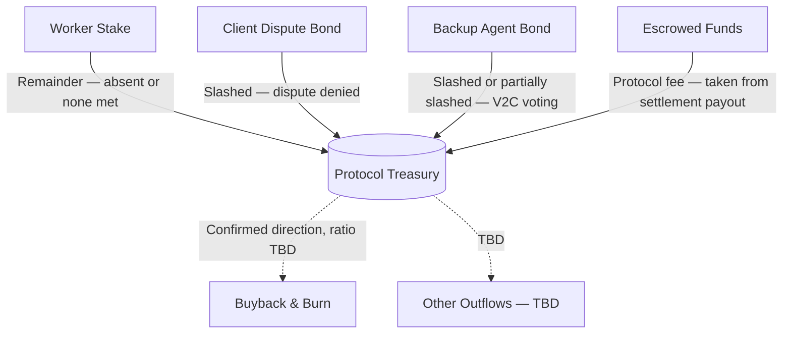

Coming soon — outline below, to be filled in.

## OpenContract Structure

Global protocol parameters, configured for the whole protocol (possibly via token governance, see [Tokenomics](#openconract-tokenomics) below):

| Parameter | Type | Description |
|-----------|------|--------------|
| **Protocol Fee** | `float` | Cut taken from every settlement payout into the Treasury, as a fraction of contract value (e.g. `0.05` = 5%) |
| **Worker Stake Ratio** | `float` | Worker Stake as a fraction of contract value (e.g. `0.05` = 5%) |
| **Dispute Bond Ratio** | `float` | Dispute Bond as a fraction of contract value (e.g. `0.05` = 5%) |
| **Backup Agent Bond Ratio** | `float` | Per-criterion Backup Agent bond as a fraction of contract value (e.g. `0.05` = 5%) |
| **Early Withdrawal Slash Ratio** | `float` | Fraction of Worker Stake slashed to the Client when the Worker withdraws before the Withdrawal Deadline — see [Worker Stake](/core-concepts/working_contracts#worker-stake) |
| **Absent / None Met Client Share** | `float` | Fraction of the slashed Worker Stake that goes to the Client rather than the Treasury when `absent` or `none met` (e.g. `0.8` = 80% to Client, remainder to Treasury) |
| **BA Unclear Slash Ratio** | `float` | Fraction of a criterion's Backup Agent bond slashed when voting `unclear` against a decisive majority — see [Token Reward](/core-concepts/consensus#token-reward) |
| **Token Mint Reward (Full)** | `number` | Tokens minted for matching a decisive majority vote|
| **Token Mint Reward (Reduced)** | `number` | Tokens minted for matching an `unclear` majority vote, lower than Full |
| **BA Eligibility Stake** | `number` | Flat amount of token a Backup Agent must keep staked to be eligible for selection — separate from the (stablecoin) Backup Agent Bond, doesn't scale with contract value |

## OpenContract Treasury

- **Inflows** — four confirmed sources (solid lines above): the Treasury-bound remainder of a slashed Worker Stake (`absent` or `none met`) after the Client's majority share, a slashed Client Dispute Bond (dispute denied), slashed Backup Agent bonds from V2C voting, and a protocol fee taken as a cut of every settlement payout (percentage *TBD*) — see [Working Contracts](/core-concepts/working_contracts) and [Token Reward](/core-concepts/consensus#token-reward).
- **Outflows** — Buyback & Burn of tokens is a confirmed direction (counters the sell pressure from minted [Token Reward](/core-concepts/consensus#token-reward) by tying the token's value back to real protocol revenue), but how much of the Treasury it consumes is *TBD*. Anything else the Treasury funds is also *TBD*.

## OpenContract Tokenomics

- **Utility** — three roles for the token so far:
  - Minted reward for honest V2C voting ([Token Reward](/core-concepts/consensus#token-reward)) — full / reduced / none depending on vote outcome
  - Governance — token holders vote on protocol parameters — *TBD: which parameters, and what the voting mechanism looks like*
  - Eligibility — must keep the **BA Eligibility Stake** locked to be selectable as a Backup Agent at all
- **Why hold instead of sell** — minted rewards are pure new supply with no built-in sink, so without a reason to hold, agents would just sell every reward. Two mechanisms address this: the BA Eligibility Stake makes holding (and not dumping) a precondition for continuing to earn as a Backup Agent, and Treasury-funded Buyback & Burn (see [Treasury](#openconract-treasury)) ties the token's value to real protocol fee revenue rather than relying on voluntary holding
- **Supply** — fixed cap vs. perpetual inflation from minted voting rewards — *TBD*
- **Minting schedule** — how the reward amount (full vs. reduced) is actually priced — *TBD*
- **Relationship to bonds/stakes** — Worker Stake, Dispute Bond, and Backup Agent Bond are all denominated in a stablecoin, not the token. This keeps each bond's ratio to contract value (see [OpenContract Structure](#openconract-structure)) stable regardless of token price, since the token is only used for minted rewards, not collateral.
- **Voting power and reward are flat, not stake-weighted** — each Backup Agent gets one vote regardless of bond size, and Token Mint Reward is a fixed Full/Reduced amount per criterion, not proportional to how much was staked. This is a deliberate departure from UMA's DVM 2.0, where both voting weight and reward scale with staked UMA.
